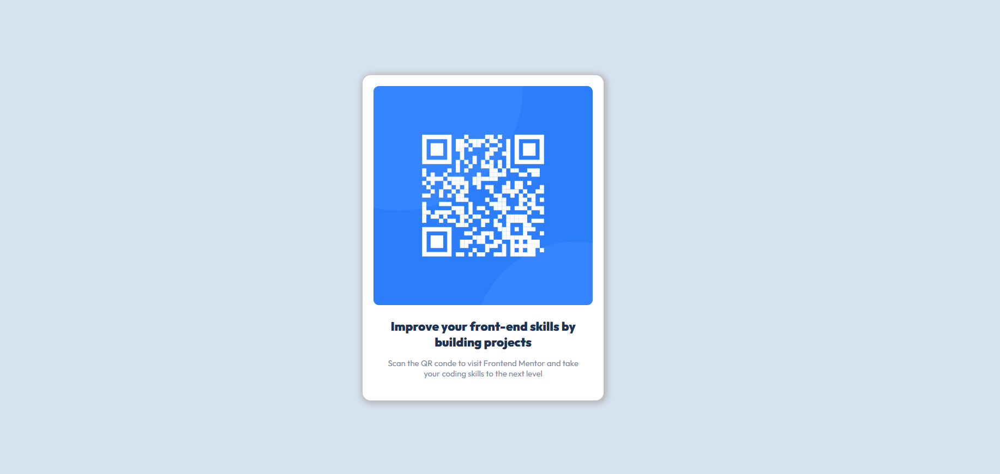

# Frontend Mentor - QR code component solution

This is a solution to the [QR code component challenge on Frontend Mentor](https://www.frontendmentor.io/challenges/qr-code-component-iux_sIO_H). Frontend Mentor challenges help you improve your coding skills by building realistic projects. 

## Table of contents

- [Overview](#overview)
  - [Screenshot](#screenshot)
  - [Links](#links)
- [My process](#my-process)
  - [Built with](#built-with)
- [Contact](#contact)

## Overview

### Screenshot

### Links

- Live Site URL : [https://wanhsuan625.github.io/frontend-mentor/1.%20qr-code-component-main/index.html](https://wanhsuan625.github.io/frontend-mentor/1.%20qr-code-component-main/index.html?_blank)
- Solution URL : [https://github.com/wanhsuan625/frontend-mentor/tree/main/1.%20qr-code-component-main](https://github.com/wanhsuan625/frontend-mentor/tree/main/1.%20qr-code-component-main?_blank)

## My process

### Built with

- Semantic HTML5 markup
- CSS custom properties
- Flexbox

## Contact

- :woman: 詹宛璇 Wan Hsuan, Chan
- :e-mail: Email: bna279@gmail.com
- Frontend Mentor - [Bonnie Chan](https://www.frontendmentor.io/profile/wanhsuan625)