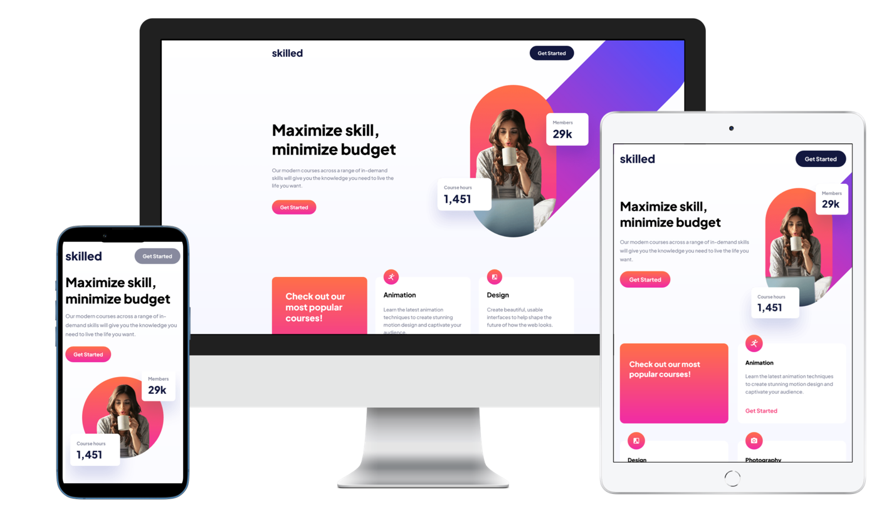

# Frontend Mentor - Skilled e-learning landing page solution

This is a solution to the [Skilled e-learning landing page challenge on Frontend Mentor](https://www.frontendmentor.io/challenges/skilled-elearning-landing-page-S1ObDrZ8q). Frontend Mentor challenges help you improve your coding skills by building realistic projects.

## Table of contents

- [Overview](#overview)
  - [The challenge](#the-challenge)
  - [Screenshot](#screenshot)
  - [Links](#links)
- [My process](#my-process)
  - [Built with](#built-with)
- [Contact](#contact)

## Overview

### The challenge

Users should be able to:

- View the optimal layout depending on their device's screen size
- See hover states for interactive elements

### Screenshot

### Links

- Live Site URL: [https://wanhsuan625.github.io/frontend-mentor/4.%20skilled-elearning-landing-page/starter-code/index.html](https://wanhsuan625.github.io/frontend-mentor/4.%20skilled-elearning-landing-page/starter-code/index.html?_blank)
- Solution URL: [https://github.com/wanhsuan625/frontend-mentor/tree/main/skilled-elearning-landing-page](https://github.com/wanhsuan625/frontend-mentor/tree/main/skilled-elearning-landing-page?_blank)

## My process

### Built with

- Semantic HTML5 markup
- CSS custom properties
- SASS/SCSS
- Flexbox
- CSS Grid

## Contact

- :woman: 詹宛璇 Wan Hsuan, Chan
- :e-mail: Email: bna279@gmail.com
- Frontend Mentor - [Bonnie Chan](https://www.frontendmentor.io/profile/wanhsuan625?_blank)