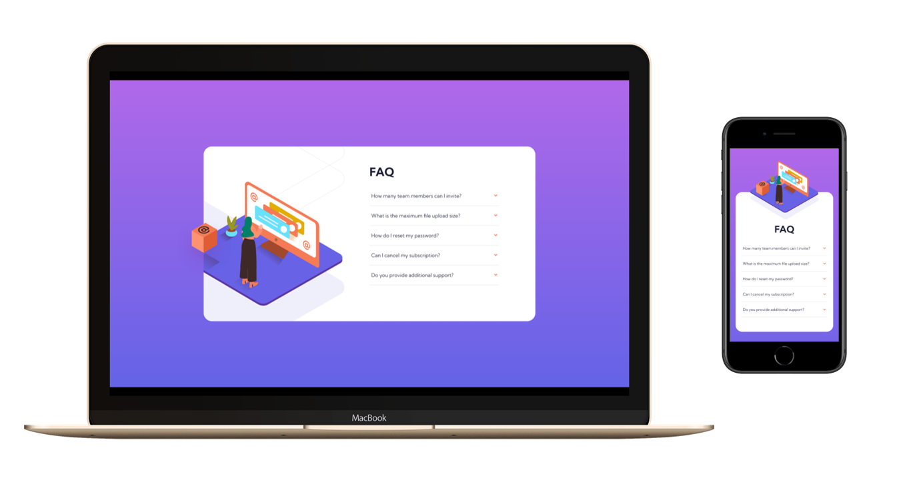

# Frontend Mentor - FAQ accordion card solution

This is a solution to the [FAQ accordion card challenge on Frontend Mentor](https://www.frontendmentor.io/challenges/faq-accordion-card-XlyjD0Oam). Frontend Mentor challenges help you improve your coding skills by building realistic projects. 

## Table of contents

- [Overview](#overview)
  - [The challenge](#the-challenge)
  - [Screenshot](#screenshot)
  - [Links](#links)
- [My process](#my-process)
  - [Built with](#built-with)
  - [What I learned](#what-i-learned)
  - [Useful resources](#useful-resources)
- [Contact](#contact)

## Overview

### The challenge

Users should be able to:

- View the optimal layout for the component depending on their device's screen size
- See hover states for all interactive elements on the page
- Hide/Show the answer to a question when the question is clicked

### Screenshot



### Links

- Live Site URL: [site](https://wanhsuan625.github.io/frontend-mentor/6.%20faq-accordion-card-main/index.html)

## My process

### Built with

- Semantic HTML5 markup
- CSS custom properties
- SASS/SCSS
- Flexbox
- Mobile-first workflow

### What I learned

HTML5 has the folder element `<details></details>` , thus it's more simple to show the question.
We can control this element by `element.open = true | false` by javascript.

```html
<details>
    <summary>put topic here</summary>
    <p>content here</p>
</details>
```

### Useful resources

- [details](https://developer.mozilla.org/zh-CN/docs/Web/HTML/Element/details)

## Contact

- :woman: 詹宛璇 Wan Hsuan, Chan
- :e-mail: Email: bna279@gmail.com
- Frontend Mentor - [Bonnie Chan](https://www.frontendmentor.io/profile/wanhsuan625?_blank)