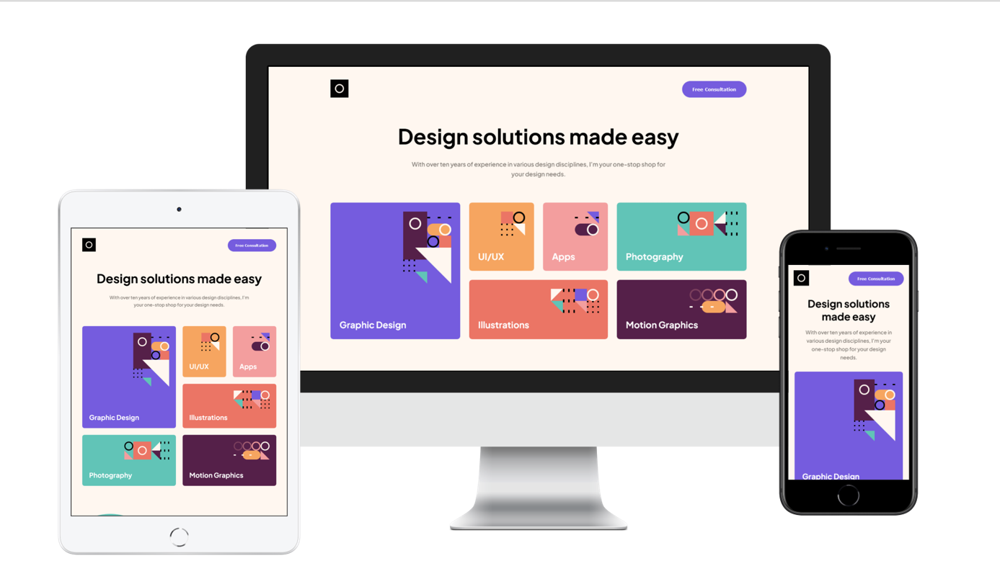

# Frontend Mentor - Single-page design portfolio solution

This is a solution to the [Single-page design portfolio challenge on Frontend Mentor](https://www.frontendmentor.io/challenges/singlepage-design-portfolio-2MMhyhfKVo). Frontend Mentor challenges help you improve your coding skills by building realistic projects. 

## Table of contents

- [Overview](#overview)
  - [The challenge](#the-challenge)
  - [Screenshot](#screenshot)
  - [Links](#links)
- [My process](#my-process)
  - [Built with](#built-with)
  - [Useful resources](#useful-resources)
- [Author](#author)

## Overview

### The challenge

Users should be able to:

- View the optimal layout for the site depending on their device's screen size
- See hover states for all interactive elements on the page
- Navigate the slider using either their mouse/trackpad or keyboard

### Screenshot

### Links

- Live Site URL: [ live site ](https://wanhsuan625.github.io/frontend-mentor/8.single-page-design-portfolio/index.html)

## My process

### Built with

- Semantic HTML5 markup
- SCSS with BEM
- CSS custom properties
- CSS Grid
- Flexbox
- Mobile-first workflow
- Swiper ─ slider show

### Useful resources

- [Swiper](https://swiperjs.com/) - This helped me for slide show of images. I really liked this and it's very good.

## Contact

- :woman: 詹宛璇 Wan Hsuan, Chan
- :e-mail: Email: bna279@gmail.com
- Frontend Mentor - [Bonnie Chan](https://www.frontendmentor.io/profile/wanhsuan625?_blank)