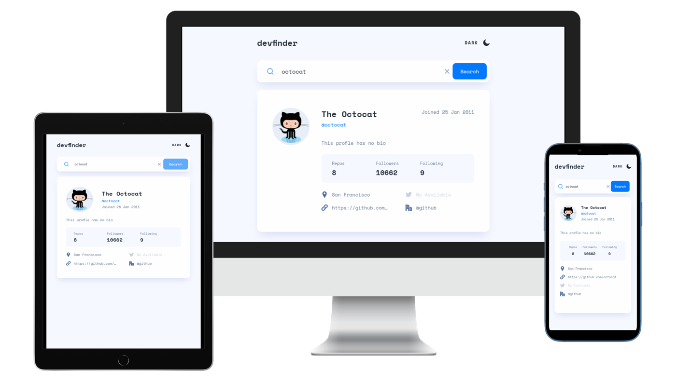

# Frontend Mentor - GitHub user search app solution

This is a solution to the [GitHub user search app challenge on Frontend Mentor](https://www.frontendmentor.io/challenges/github-user-search-app-Q09YOgaH6). Frontend Mentor challenges help you improve your coding skills by building realistic projects. 

## Table of contents

- [Overview](#overview)
  - [The challenge](#the-challenge)
  - [Screenshot](#screenshot)
  - [Links](#links)
- [My process](#my-process)
  - [Built with](#built-with)
  - [What I learned](#what-i-learned)
  - [Useful resources](#useful-resources)
- [Contact](#contact)

## Overview

### The challenge

Users should be able to:

- View the optimal layout for the app depending on their device's screen size
- See hover states for all interactive elements on the page
- Search for GitHub users by their username
- See relevant user information based on their search
- Switch between light and dark themes
- **Bonus**: Have the correct color scheme chosen for them based on their computer preferences. _Hint_: Research `prefers-color-scheme` in CSS.

### Screenshot



### Links

- Live Site URL: [live site](https://wanhsuan625.github.io/frontend-mentor/9.github-user-search-app/index.html)

## My process

### Built with

- Semantic HTML5 markup
- SCSS
- CSS custom properties
- Flexbox
- CSS Grid
- Mobile-first workflow
- Fetch API
- JavaScript

### What I learned

I spent lots of time on light / dark mode switch. I initially set `@media (prefers-color-scheme: dark)` in the CSS file, but later I found it easier to manipulate `prefers-color-scheme` through JavaScript, and it allows me to toggle light/dark mode with buttons.

```css
.darkmode{
    /* Moify colors*/
    --wrapper: #141D2F;
    --background: #1E2A47;
    --primary: #FFFFFF;
    --secondary: #FFFFFF;
    --neutral: #FFFFFF;
    --switch: #90A4D4;
    
    .header__mode-icon{
        filter: brightness(0) saturate(100%) invert(89%) sepia(14%) saturate(7054%) hue-rotate(185deg) brightness(87%) contrast(89%);
    }
    .social-box__icon{
        filter: brightness(0) saturate(100%) invert(100%) sepia(1%) saturate(2%) hue-rotate(4deg) brightness(113%) contrast(101%);
    }
    /* Clear box shadow */
    .search , .content-container{
        box-shadow: none;
    }
}
```

```js
const prefersDark = window.matchMedia && window.matchMedia('(prefers-color-scheme: dark)').matches;
let isDarkMode = ( prefersDark ) ? true : false;
```

### Useful resources

- [Filter Generator](https://angel-rs.github.io/css-color-filter-generator/) - This helped me for changing the color of svg file.

## Contact

- :woman: 詹宛璇 Wan Hsuan, Chan
- :e-mail: Email: bna279@gmail.com
- Frontend Mentor - [Bonnie Chan](https://www.frontendmentor.io/profile/wanhsuan625?_blank)